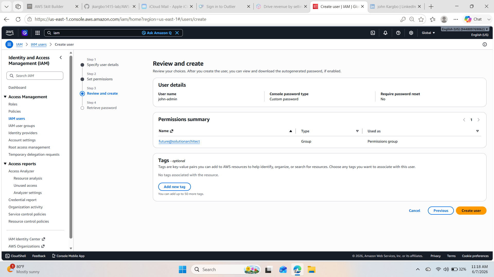
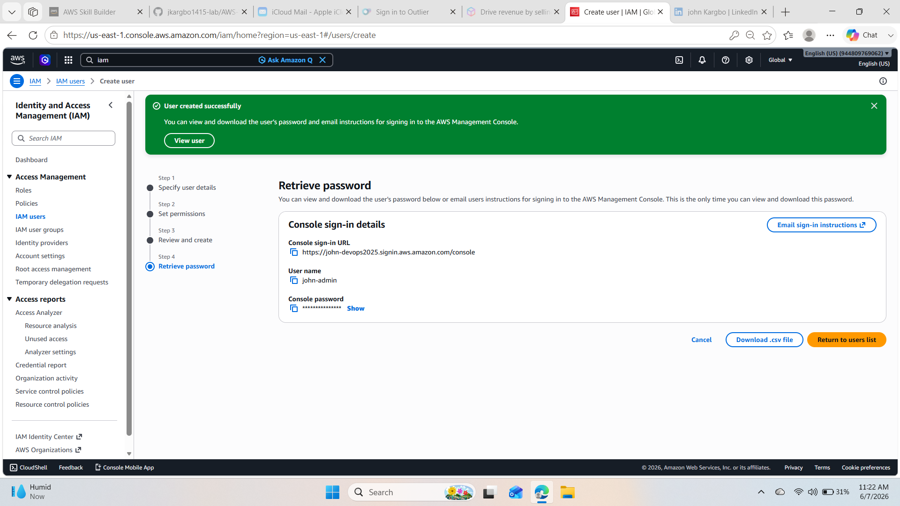
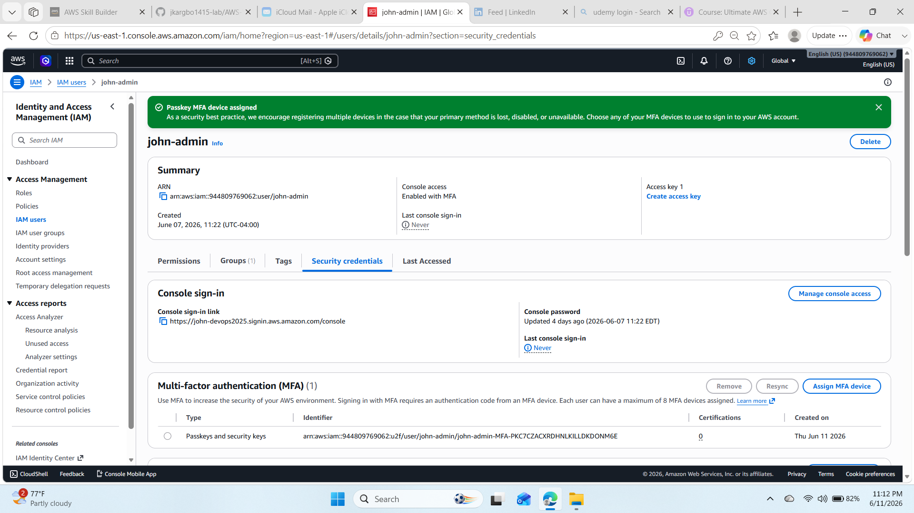
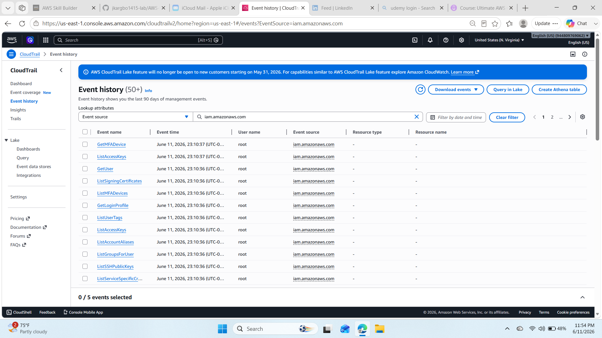
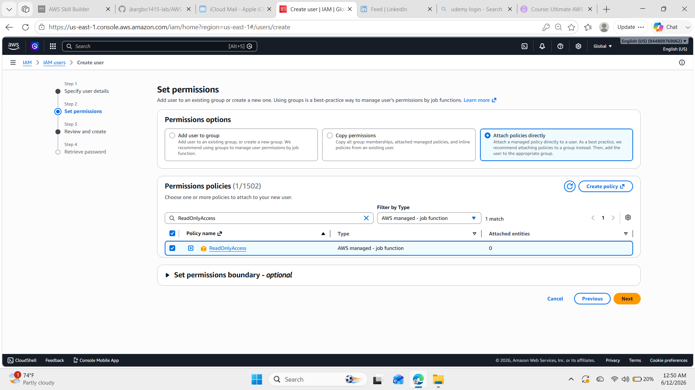
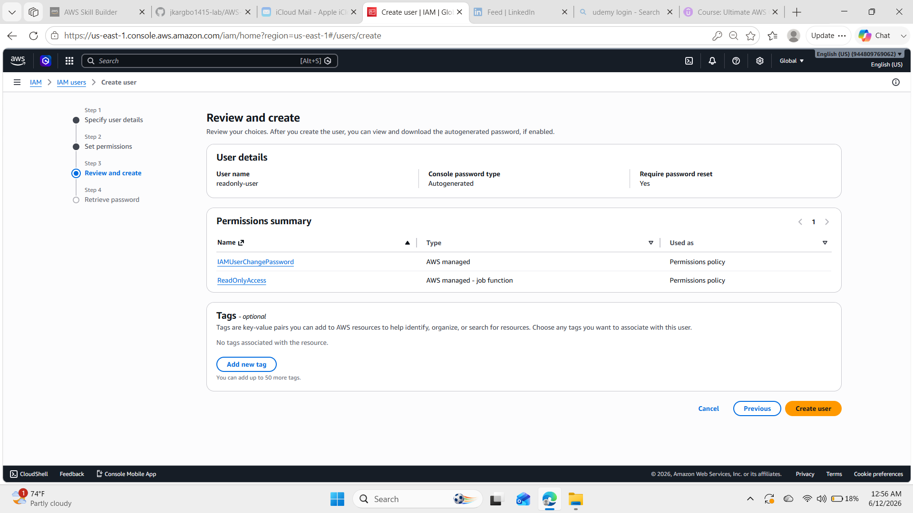
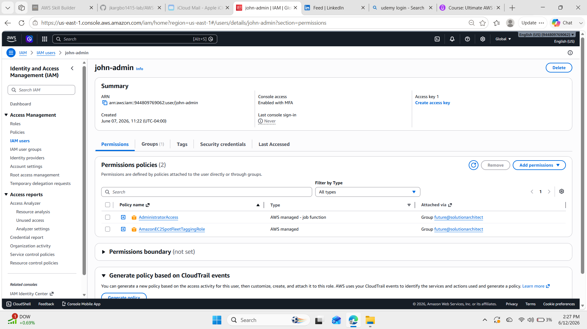
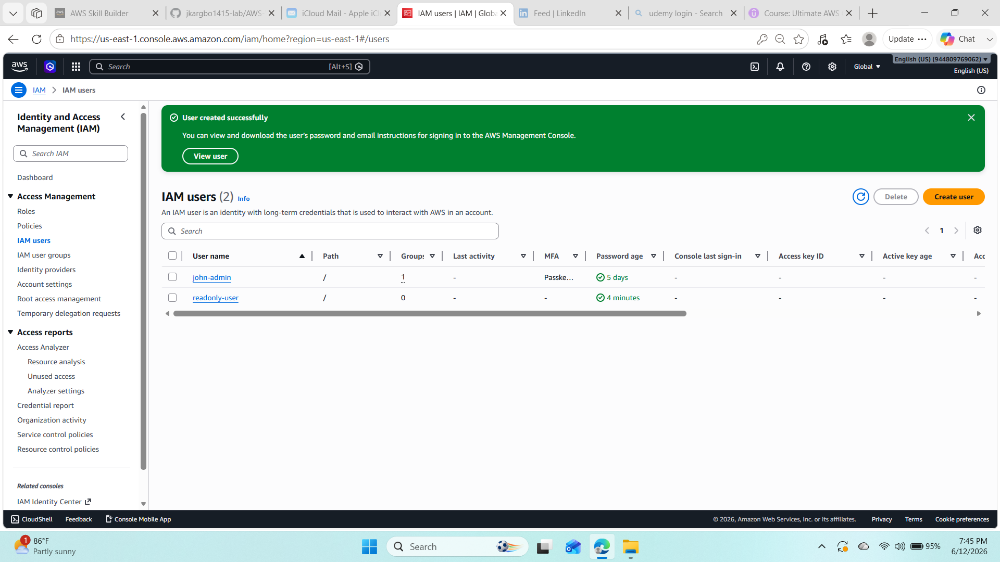
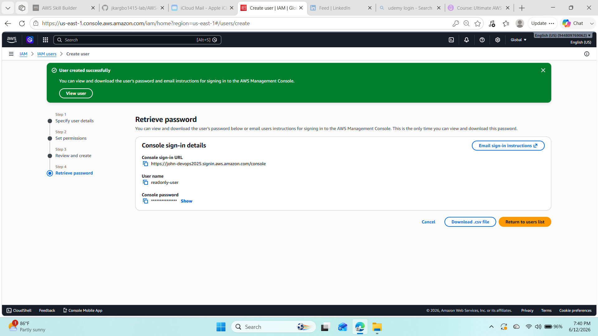
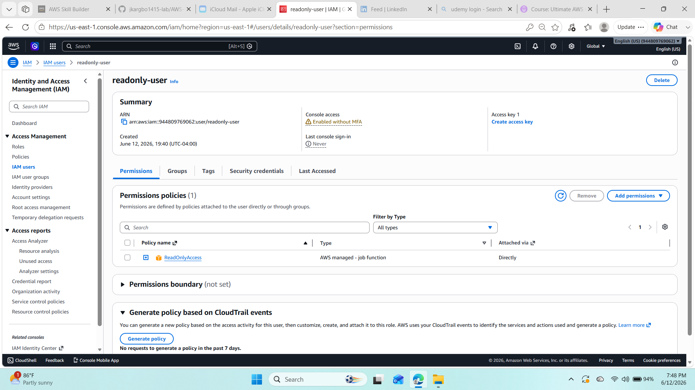

# AWS IAM Security, MFA, Least Priviledge, and CloudTrail Monitoring Project

## Project Overview
This project demonstrates AWS Identity and Access Management (IAM) security best practices by creating secure IAM users, assigning permissions using the principle of least priviledge , enabling Multi-Factor Authentication (MFA), and monitoring account activity with AWS CloudTrail.
The goal of this project was to gain hands-on experience implementing security controls commonly used in production AWS environments.

## Objectives
- Create an administrative IAM user.
- Enable Multi-Factor Authentication (MFA).
- Apply the principle of least priviledge.
- Create a ReadOnly IAM user.
- Monitor IAM activity using AWS CloudTrail.
- Document the enntire implementation with screenshots.

## AWS Services Used
- AWS Identity and Access Management (IAM)
- AWS CloudTrail

## Skills Demonstrated
- IAM User Management
- Permission Management
- Least Privilege Security
- Multi-Factor Authentication
- AWS Security Best Practices
- CloudTrail Monitoring
- Github Documentation

   ## Implementation Steps
1. Created an administrative IAM user.
2. Enabled MFA for the administrator account.
3. Assigned administrator permissions through an IAM group.
4. Created a ReadOnly IAM user.
5. Assigned the AWS ReadOnly Access policy.
6. Verified User permissions.
7. Reviewed IAM activity using AWS CloudTrail.
8. Documented the implementation with screenshots.

## Screenshots
### 01-Admin User Review

### 02-Admin User Created

### 03-MFA Enabled

### 04-CloudTrail IAM Events

### 05-ReadOnly Policy Assigned

### 06-ReadOnly User Review

### 07-Admin Permissions

### 08-IAM User List

### 09-ReadOnly User Created

### 10-ReadOnly User Permissions

## Key Takeaways
Through this project i strengethened my understanding of AWS Identity and Access management by implementing secure user administration, applying least privilege permissions, enabling MFA, and using CloudTrail to monitor security-related events. These practices form the foundationof securing AWS environments.

- 
